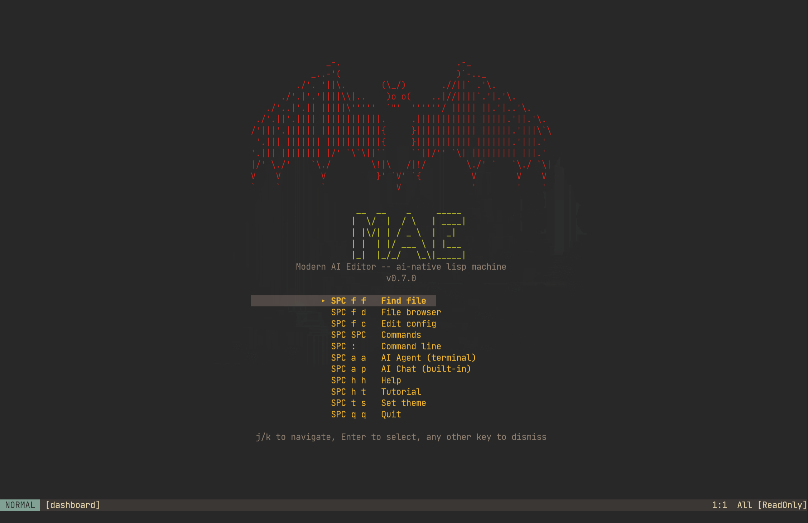

# MAE — Modern AI Editor

[](https://www.gnu.org/licenses/gpl-3.0)
[](https://www.rust-lang.org/)
[](#)
[](#)
[](https://github.com/cuttlefisch/mae)

An AI-native lisp machine IDE — a programmable development environment where the
human and the AI are peer actors calling the same Scheme primitives. Built on a
Rust core with an embedded R7RS-small runtime. GUI + terminal.

<p align="center">
  
</p>

## Features

- **AI as peer actor** — 450+ editor commands exposed as AI tools. The AI calls
  the same `dispatch_builtin()` as your keybindings. No shadow API, no simulated
  keystrokes.
- **Collaborative editing** — CRDT sync engine (yrs/YATA) with state server,
  WAL persistence, per-user undo, awareness protocol, PSK authentication, and
  mDNS peer discovery. Collaborative KB sharing enables real-time knowledge base
  sync across instances with offline edit + reconnect support.
- **Org-mode babel** — Execute code blocks in 12 languages, noweb expansion,
  `:tangle` directive, `:var` cross-references, safety policies. Export to
  HTML and Markdown with TOC, syntax highlighting, tag filtering.
- **Runtime redefinability** — Embedded R7RS Scheme (mae-scheme). Redefine any
  function while running. 45+ primitives, 18 hook points, `init.scm` is a
  real program.
- **Full vi modal editing** — Motions, operators, text objects, count prefix,
  dot repeat, macros, registers, marks, surround, visual block mode, multi-cursor.
- **LSP first-class** — Go-to-definition, references, hover, completion, rename,
  format, symbol outline, breadcrumbs, peek references. AI gets structured
  semantic data.
- **DAP first-class** — Multi-language debugging (Python, Rust, C/C++).
  Breakpoints (conditional, logpoint), watch expressions, exception breakpoints.
  AI can set breakpoints and inspect variables.
- **Multi-provider AI** — Claude, OpenAI, Gemini, and DeepSeek. Provider-aware
  prompt tuning. Tiered prompt system (Full/Compact) with per-model guardrails.
- **Knowledge base** — SQLite + FTS5 graph store. 200+ help nodes, bidirectional
  links, org-mode parser, federated instances. Same docs the AI reads.
- **Tree-sitter** — 13 languages with structural parse trees. AI can query
  syntax trees for code reasoning.
- **GUI + Terminal** — winit + Skia 2D hardware-accelerated GUI, ratatui
  terminal fallback. Inline images (PNG/JPG/SVG), variable-height rendering,
  inertial scrolling. Desktop launcher for freedesktop environments.
- **Embedded terminal** — Full VT100/VT500 via `alacritty_terminal`. AI can
  observe output and send input. `Ctrl-\ Ctrl-n` exits to normal mode.

## Architecture

```
   Human (keys)      Scheme (eval)      AI / MCP (tool call)
        │                  │                     │
        ▼                  ▼                     ▼
   ┌───────────┐    ┌─────────────┐    ┌────────────────────┐
   │ Keymap    │    │ (run-cmd)   │    │  Tool wrappers     │
   │ Lookup    │    │ (define-    │    │  → same functions  │
   │           │    │  command)   │    │  as keybindings    │
   └─────┬─────┘    └──────┬──────┘    └─────────┬──────────┘
         │                 │                     │
         └────────────┬────┴─────────────────────┘
                      ▼
         ┌───────────────────────────┐
         │     Editor Core API       │
         │  dispatch_builtin()       │
         │  buffer.insert/delete()   │
         │  lsp/dap/kb/shell ops     │
         │                           │
         │  450+ commands · same     │
         │  functions for all actors │
         └─────────────┬─────────────┘
                       ▼
         ┌───────────────────────────┐
         │      Editor State         │
         │  Buffers · LSP · DAP      │
         │  Shell · KB · Themes      │
         └───────────────────────────┘
```

All three actors converge on the same Editor Core API. The AI's tools are thin
wrappers — `buffer_read` calls the same `buffer.line()` the renderer uses;
`lsp_definition` queues the same intent as pressing `gd`. When a package author
writes `(define my/summarize ...)`, it's immediately available to both the
user's keybinding and the AI's tool palette.

### Crate Layout

```
mae (binary)
 ├── mae-core        Buffer (rope), editor state, commands, keymap, syntax
 ├── mae-renderer    Terminal rendering (ratatui), status bar, popups, shell viewport
 ├── mae-gui         GUI rendering (winit + Skia 2D), mouse input, font config, inline images
 ├── mae-scheme      R7RS-small Scheme runtime, init.scm loading, hook dispatch
 ├── mae-ai          Claude + OpenAI + Gemini + DeepSeek providers, tool execution, conversation
 ├── mae-lsp         LSP client — connection, navigation, diagnostics, completion, formatting
 ├── mae-dap         DAP client — protocol types, transport, breakpoints, stepping, watches
 ├── mae-shell       Terminal emulator (alacritty_terminal), PTY management
 ├── mae-kb          Knowledge base — graph store, org-mode parser, FTS5 search, federation
 ├── mae-mcp         MCP server — Unix socket, JSON-RPC, stdio shim
 ├── mae-sync        Collaborative sync — yrs CRDT, ropey bridge, encoding helpers
 ├── mae-state-server  Standalone collab state server — TCP sync, WAL persistence
 ├── mae-babel       Org-babel executor — 12 languages, persistent sessions, language backends
 ├── mae-export      Org/Markdown export — HTML, Markdown, TOC, syntax highlighting
 ├── mae-snippets    YASnippet-style templates — tab-stops, mirrors, transforms
 ├── mae-format      Formatter bridge — prettier, black, rustfmt (complements LSP format)
 ├── mae-make        Build runner — Makefile/Cargo.toml/package.json detection
 ├── mae-lookup      Unified lookup — LSP def + docs URL + man pages
 └── mae-spell       Spellcheck — hunspell/aspell integration, inline markers
```

## Getting Started

### Prerequisites

- **Rust stable** (1.95+) via [rustup](https://rustup.rs)
- **GUI deps:** `clang`, `fontconfig-devel`, `freetype-devel` (Fedora) / `clang`, `libclang-dev`, `libfontconfig1-dev`, `libfreetype6-dev` (Debian/Ubuntu) / Xcode CLI Tools (macOS)
- **TUI-only:** `make build-tui` — no clang or GUI deps needed
- **Optional:** `make setup-dev` installs `clang`, `lldb`, `rust-analyzer`, `debugpy` for full self-test coverage
- **Check deps:** `make doctor` — reports all prerequisites with install commands

### Build & Run

```sh
git clone git@github.com:cuttlefisch/mae.git && cd mae
make doctor                     # check prerequisites
make build                      # GUI build (default)
make install                    # install to ~/.local/bin + desktop launcher
mae --init-config               # generate config.toml + init.scm + wizard
mae --gui file.rs               # launch GUI
mae file.rs                     # terminal mode
make build-tui                  # terminal-only (no clang/skia dependency)
```

**macOS:** `make install PREFIX=/usr/local/bin` or add `~/.local/bin` to PATH.
**WSL:** `make install-tui` (terminal-only, no X11 needed).

### Container Build

No Rust installation needed — everything runs inside Docker:

```sh
git clone git@github.com:cuttlefisch/mae.git && cd mae
make docker-ci          # full CI pipeline (fmt + clippy + check + test)
make docker-new-user    # validate first-run experience in clean environment
make docker-dev         # interactive dev shell with Rust toolchain
```

See [CONTRIBUTING.md](CONTRIBUTING.md) for the full container development workflow.

### AI Setup

> [!CAUTION]
> **MAE is in early Alpha.** AI features and cost guardrails are experimental.
> Always monitor your API usage and costs directly in your provider dashboards.

Set one of these environment variables:

```sh
export ANTHROPIC_API_KEY=sk-ant-...    # Claude (default) — https://console.anthropic.com/settings/keys
export OPENAI_API_KEY=sk-...           # OpenAI          — https://platform.openai.com/api-keys
export GEMINI_API_KEY=...              # Gemini           — https://aistudio.google.com/apikey
export DEEPSEEK_API_KEY=...            # DeepSeek         — https://platform.deepseek.com/api_keys
```

Or configure in `~/.config/mae/config.toml`:

```toml
[ai]
provider = "claude"
model = "claude-sonnet-4-20250514"

# Optional: permission tier (readonly, write, shell, privileged)
# Default: shell (AI can read, write, and run commands)
permission_tier = "shell"

# Optional: force prompt tier (full, compact)
# Default: auto-detected from model
# prompt_tier = "full"
```

**Provider-aware prompts:** MAE auto-detects the provider from the model name
and injects provider-specific guidance (e.g., Gemini gets explicit JSON
examples; DeepSeek gets anti-looping guardrails).

### First Steps

1. `:tutor` — interactive tutorial (13 lessons: vim, beginner, AI tracks)
2. `SPC SPC` — command palette (fuzzy search all commands)
3. `SPC f f` — find file in project
4. `SPC h h` — help index (knowledge base)
5. `SPC a a` — launch AI agent in embedded shell
6. `SPC a p` — start an AI conversation
7. `:self-test` — verify AI integration

### Configuration

MAE loads `~/.config/mae/init.scm` on startup. This is a real Scheme program,
not a settings file:

```scheme
;; Example init.scm
(set-option! "theme" "gruvbox-dark")
(set-option! "relative-line-numbers" "true")
(set-option! "word-wrap" "true")

;; Custom keybinding
(define-key "normal" "SPC t t" "cycle-theme")

;; Hook: run on buffer save
(add-hook! "before-save" "my-format-fn")
```

Project-local config: `.mae/init.scm` is loaded after user config.

Useful commands:
- `mae --check-config` — validate config + init.scm without launching (CI-friendly)
- `mae --clean` / `mae -q` — pristine launch, skip all config/init/history (like `emacs -q`)
- `:edit-config` — edit `init.scm` from inside the editor
- `:edit-settings` — edit `config.toml` from inside the editor
- `:describe-configuration` — health report (AI, LSP, DAP status)

## Module System

MAE uses a Doom Emacs-inspired module system. Each module is a directory with
`module.toml` (metadata), `autoloads.scm` (keybindings), and optionally `init.scm`
(user config). Modules are loaded at startup and can be live-reloaded.

```sh
mae pkg list            # list installed modules with status
mae pkg info surround   # show module details and dependencies
mae pkg doctor          # health check all modules
mae pkg sync            # synchronize module state
mae pkg create mymod    # scaffold a new module from template
```

**19 built-in modules** by category:

| Category | Modules |
|----------|---------|
| UI | `dashboard`, `file-tree` |
| Editor | `surround`, `marks-jumps`, `search`, `registers`, `macros`, `multicursor`, `tables` |
| Tools | `snippets`, `format`, `make`, `lookup`, `spell` |
| Lang | `lang-python`, `lang-rust`, `lang-go`, `lang-javascript`, `lang-cc` |

Enable modules with `+flag` syntax in `init.scm`. See [Extension Guide](docs/EXTENSION_GUIDE.md)
for authoring custom modules.

## Vim-Level Editing

Full vi modal editing with 450+ commands:

| Category | Features |
|----------|----------|
| Modes | Normal, Insert, Visual (char/line/block), Command, Search, ShellInsert |
| Motions | hjkl, w/b/e/W/B/E, f/F/t/T, %, {/}, 0/$, gg/G, H/M/L, ge/gE |
| Operators | d, c, y — compose with any motion or text object |
| Text objects | `iw`, `aw`, `i(`, `a{`, `i"`, `it` (tag), and more |
| Count prefix | 5j, 3dd, 2dw |
| Dot repeat | Full `.` repeat for change/delete/insert sequences |
| Registers | Named (`"a`–`"z`), numbered (`"0`–`"9`), system clipboard (`"+`) |
| Macros | `qa` record, `q` stop, `@a` play, `@@` repeat |
| Marks | `ma` set, `'a` jump, `` `a `` exact position |
| Search | `/pattern`, `?pattern`, `n`/`N`, `*`, `:s///g`, `:%s` |
| Surround | `ys{motion}{char}`, `cs{old}{new}`, `ds{char}` (vim-surround) |
| Multi-cursor | `Ctrl-d` add next match, `Ctrl-Alt-d` add all, `mc-align` |
| Scroll | Ctrl-U/D/F/B, zz/zt/zb, inertial (kinetic) scrolling in GUI |
| Leader | `SPC` leader system (Doom Emacs style) with which-key popup |
| Code folding | `za` toggle, `zM` close all, `zR` open all (tree-sitter ranges) |
| File tree | `SPC f t` sidebar with expand/collapse, git markers |
| Git status | `SPC g s` Magit-style: stage/unstage/discard at hunk level |
| Swap files | Crash recovery via non-destructive swap files |

### Key Bindings

| Key | Mode | Action |
|-----|------|--------|
| `i`, `a`, `A`, `o`, `O` | Normal | Enter insert mode |
| `Esc` | Any | Return to normal mode |
| `v` / `V` | Normal | Visual char / line selection |
| `d`, `c`, `y` | Normal/Visual | Delete, change, yank |
| `.` | Normal | Repeat last edit |
| `/`, `?` | Normal | Search forward / backward |
| `:` | Normal | Command mode |
| `gd` | Normal | Go to definition (LSP) |
| `gr` | Normal | Find references (LSP) |
| `K` | Normal | Hover docs (LSP) |
| `SPC SPC` | Normal | Command palette |
| `SPC f f` | Normal | Fuzzy file picker |
| `SPC a a` | Normal | AI agent (shell) |
| `SPC a p` | Normal | AI conversation |
| `SPC o t` | Normal | Open terminal |
| `SPC d b` | Normal | Toggle breakpoint |
| `SPC h h` | Normal | Help index |
| `Ctrl-\ Ctrl-n` | ShellInsert | Exit terminal → Normal |

### Ex Commands

```
:w              Save
:e path         Open file
:q              Quit
:wq             Save and quit
:s/old/new/g    Substitute (current line)
:%s/old/new/g   Substitute (whole buffer)
:theme name     Switch theme
:eval (expr)    Evaluate Scheme
:help topic     Open help
:terminal       Open terminal
:tutor          Interactive tutorial
:self-test      AI integration test
:set opt=val    Set editor option
:split / :vsplit  Window splitting
:diagnostics    Show LSP diagnostics
:messages       View message log
:describe-configuration  Show config health report
```

## Stack

| Layer | Technology | Why |
|-------|-----------|-----|
| Core | Rust | Eliminates GC problem, ownership model for concurrency |
| Extensions | Scheme R7RS-small (mae-scheme) | Runtime redefinability, hygienic macros, tail calls |
| Terminal UI | ratatui + crossterm | Platform-specific code in the library, not us |
| GUI | winit + skia-safe | Hardware-accelerated 2D, mouse, fonts, inline images |
| Terminal emulator | alacritty_terminal | Full VT100/VT500, same engine as Alacritty |
| AI | Claude / OpenAI / Gemini / DeepSeek | Tool-calling maps 1:1 to command API |
| Protocols | LSP + DAP | First-class — exposed to Scheme and AI |
| Knowledge base | SQLite + FTS5 | Graph store with full-text search, federation |
| Syntax | tree-sitter | 13 languages, structural parse trees |
| Literate programming | Org-babel | 12 execution languages, tangle, noweb, export |

## Roadmap

See [ROADMAP.md](ROADMAP.md) for detailed milestone tracking.

| Phase | Status | Summary |
|-------|--------|---------|
| 1. Core + Renderer | ✅ Complete | Buffer (rope), event loop, terminal renderer, modal editing |
| 2. Scheme Runtime | ✅ Complete | R7RS-small (mae-scheme), config loading, `define-key`, REPL |
| 3. AI Integration | ✅ Complete | Multi-provider tool-calling, conversation, permissions |
| 4. LSP + DAP + Syntax | ✅ Complete | Full LSP client, DAP client, 13-language tree-sitter |
| 5. Knowledge Base | ✅ Complete | SQLite graph, org parser, FTS5, manual, federation |
| 6. Embedded Shell | ✅ Complete | alacritty_terminal, MCP bridge, file auto-reload |
| 7. Documentation | ✅ Complete | Tutor (13 lessons), `:describe-configuration`, `--check-config` |
| 8. GUI Backend | ✅ Complete | winit + Skia, inline images, variable-height, inertial scroll |
| 9. Babel + Export | ✅ Complete | 12-language executor, HTML/Markdown export, KB federation |
| 10. AI Agent Efficiency | ✅ Complete | Tiered prompts, provider-aware hints, target dispatch, frame profiling |
| 11. Module System | ✅ Complete | 19 modules (Doom model), `mae pkg` CLI, flags, live reload |
| 12. Collaborative Editing | 🔧 Protocol complete | CRDT state server, multi-peer sync, WAL persistence, awareness, per-user undo. User-facing release blocked on Scheme runtime (Phase 13) |
| 13. Scheme Runtime | 🔧 Planned | MAE-native R7RS-small with `mae:` namespace, async/yield, proper error signaling |
| **Next** | 🔧 In progress | Scheme runtime replacement, PDF preview, semantic search. See [MODEL_SUPPORT.md](docs/MODEL_SUPPORT.md) |

## Design Lineage

MAE is informed by analysis of [35 years of Emacs git
history](https://github.com/emacs-mirror/emacs) — identifying the structural
decisions that led to its current maintenance burden:

- **GC retrofit is intractable** — 23,901 commits across 3 branches, still
  unmerged. MAE uses Rust ownership (no GC needed).
- **`xdisp.c` is 38,605 lines** — monolithic display engine. MAE uses a
  `Renderer` trait with separate terminal and GUI backends.
- **Fix ratio doubled** — from 15% to 32% over 35 years. Rust's type system
  structurally prevents this.
- **Bus factor of ~4** — top 5 contributors = 50.8% of commits. MAE enforces
  module boundaries across 18 crates.

## Self-Hosting

MAE is used to develop itself. The AI agent runs in an embedded shell, calling
the same tools the human uses. The GUI is the primary development target.

## Model Compatibility

MAE supports 33+ model prefixes across 8 providers. Run `:model-exam` to
validate any model's tool-calling capabilities with a deterministic 10-test
exam. See [MODEL_SUPPORT.md](docs/MODEL_SUPPORT.md) for the full compatibility
matrix and exam instructions.

## Data Directories

MAE follows the [XDG Base Directory Specification](https://specifications.freedesktop.org/basedir-spec/latest/):

| Path | Contents |
|------|----------|
| `~/.config/mae/` | `config.toml`, `init.scm`, `help/*.org` |
| `~/.local/share/mae/` | `swap/`, `transcripts/`, `exam-results/` |
| `~/.local/state/mae/` | `logs/`, `history.scm` |
| `.mae/` (per-project) | `session.json`, `conversation.json`, `kb.sqlite3`, `memory/`, `plans/` |

## Contributing

Feature branches + PR workflow. See [CONTRIBUTING.md](CONTRIBUTING.md) for the full guide.
Report bugs at [github.com/cuttlefisch/mae/issues](https://github.com/cuttlefisch/mae/issues).
Check [Known Bugs](ROADMAP.md#known-bugs) before filing.

```bash
make doctor      # Check build prerequisites
make ci          # Full CI pipeline locally (no GUI)
make verify      # check + test + GUI check with summary
make self-test   # AI-driven end-to-end self-test (headless)
```

See [CLAUDE.md](CLAUDE.md) for architecture principles and development guide.

## Contributing

See [CONTRIBUTING.md](CONTRIBUTING.md) for development workflow, code standards,
and where to start. For end-to-end workflow documentation, see
[docs/USER_STORIES.md](docs/USER_STORIES.md). For feature parity goals, see
[docs/COMPETITIVE_ANALYSIS.md](docs/COMPETITIVE_ANALYSIS.md).

## License

GPL-3.0-or-later — see [LICENSE](LICENSE) for details.

Contributions are owned by their authors. No copyright assignment required.
