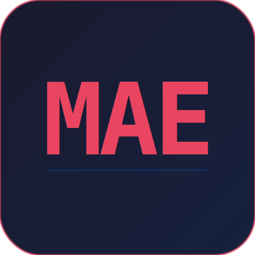

#+TITLE: Org Markup Demo
#+AUTHOR: MAE

* Heading 1 — Large Scale

Regular paragraph text for comparison.

** Heading 2 — Medium Scale

*** Heading 3 — Small Scale

** Inline Formatting

This line has *bold text* and /italic text/ and =inline code= together.

You can also combine *bold with =code= inside* or /italic with =code= inside/.

Here is ~verbatim text~ in a sentence (org uses tilde for verbatim).

** Links

Org link with description: [[https://github.com/cuttlefisch/mae][MAE on GitHub]]

Org link without description: [[https://git.savannah.gnu.org/cgit/emacs.git]]

** Code Blocks

Org source block:

#+begin_src rust
fn main() {
    let greeting = "Hello, MAE!";
    println!("{}", greeting);
    for i in 0..10 {
        eprintln!("iteration {}", i);
    }
}
#+end_src

Another source block:

#+begin_src python
def fibonacci(n):
    """Generate fibonacci sequence."""
    a, b = 0, 1
    for _ in range(n):
        yield a
        a, b = b, a + b

print(list(fibonacci(10)))
#+end_src

** TODO Lists and Keywords

*** TODO Write documentation                                       :urgent:
*** DONE Implement core features                                   :core:

- Regular list item
- *Bold list item* with =code=
- Item with /italic/ emphasis
- Item with a [[https://example.com][link]] inside
  + Nested sub-item
  + Another sub-item

** Checkboxes

- [ ] Unchecked item (press Enter to toggle)
- [x] Already checked item
- [ ] Another unchecked item

*** Progress Cookies

**** Tasks [1/3]
- [x] First task
- [ ] Second task
- [ ] Third task

**** Percentage [33%]
- [x] Alpha
- [ ] Beta
- [ ] Gamma

** Inline Images

Default width (fits to text area):

[[file:test-image.png]]

With explicit width directive:

#+attr_html: :width 200px

Narrower width:

#+attr_org: :width 100
[[file:test-image.png]]

Missing image (should show placeholder):

[[file:does-not-exist.png][Missing image]]

** Strikethrough

This text has +struck through words+ in the middle.

** Blockquotes

> This is a blockquote.
> It can span multiple lines.
>> Nested blockquotes work too.

** Horizontal Rules

A horizontal rule below (5+ dashes):

-----

Text continues after the rule.

** Priority Headings

*** TODO [#A] Critical task — priority A (red)                 :urgent:
*** TODO [#B] Normal task — priority B (yellow)                :work:
*** TODO [#C] Low priority task — priority C (green)           :later:

** Tables

| Name    | Age | City       |
|---------+-----+------------|
| Alice   |  30 | New York   |
| Bob     |  25 | London     |
| Charlie |  35 | Tokyo      |

*** Column Justification

Alignment markers in separator lines: =:---= left, =:---:= center, =---:= right.

|   Item   | Qty | Price | Status   |
|:--------:|:---:|:-----:| ---------|
|  Apples  |  12 | 1.50  | In Stock |
| Bananas  | 200 | 0.30  | In Stock |
| Cherries |   5 | 12.99 | Sold Out |

Try: Tab/S-Tab to navigate cells, SPC m b a to align.

** Timestamps and Properties

Meeting: <2026-05-01 Thu 10:00>
Deadline: [2026-05-15 Thu]

** Everything Together

This paragraph has *bold*, /italic/, =code=, ~verbatim~, +strikethrough+, and a
[[https://example.com][concealed link]] all in one place. The heading above
should have extra top padding, and code blocks should have a tinted background.
