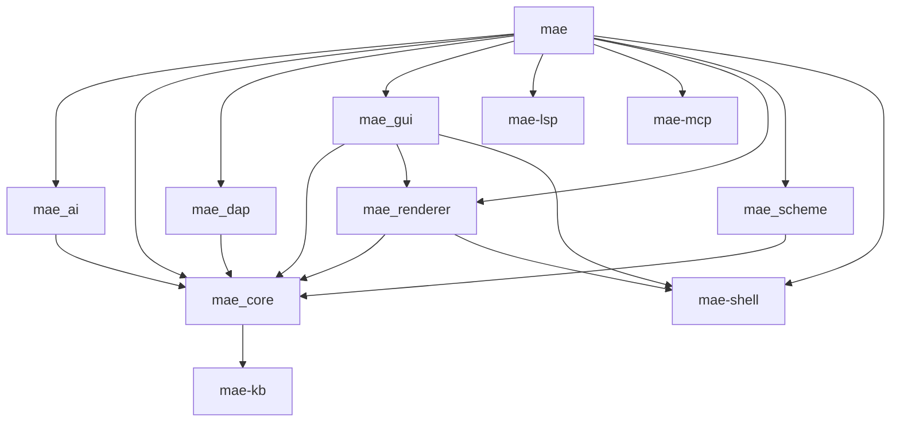

# MAE Code Map

Auto-generated by `make code-map`. Do not edit manually.

## Crate Dependencies

## mae

Source: `crates/mae/src/main.rs`

## mae-ai

Source: `crates/ai/src/lib.rs`

| Item | Kind |
|------|------|
| `claude` | mod |
| `context_limits` | mod |
| `executor` | mod |
| `gemini` | mod |
| `openai` | mod |
| `pricing` | mod |
| `provider` | mod |
| `session` | mod |
| `token_estimate` | mod |
| `tools` | mod |
| `types` | mod |

## mae-core

Source: `crates/core/src/lib.rs`

| Item | Kind |
|------|------|
| `buffer` | mod |
| `buffer_mode` | mod |
| `buffer_view` | mod |
| `clipboard` | mod |
| `command_palette` | mod |
| `commands` | mod |
| `conversation` | mod |
| `dap_intent` | mod |
| `debug` | mod |
| `debug_view` | mod |
| `diff` | mod |
| `display_region` | mod |
| `editor` | mod |
| `event_record` | mod |
| `file_browser` | mod |
| `file_picker` | mod |
| `file_tree` | mod |
| `git_status` | mod |
| `grapheme` | mod |
| `heading` | mod |
| `help_view` | mod |
| `hooks` | mod |
| `input` | mod |
| `kb_seed` | mod |
| `keymap` | mod |
| `link_detect` | mod |
| `lock_stats` | mod |
| `lsp_intent` | mod |
| `messages` | mod |
| `options` | mod |
| `project` | mod |
| `render_common` | mod |
| `search` | mod |
| `session` | mod |
| `swap` | mod |
| `syntax` | mod |
| `theme` | mod |
| `visual_buffer` | mod |
| `window` | mod |
| `word` | mod |
| `wrap` | mod |
| `VisualType` | enum |
| `Mode` | enum |

## mae-dap

Source: `crates/dap/src/lib.rs`

| Item | Kind |
|------|------|
| `client` | mod |
| `manager` | mod |
| `protocol` | mod |
| `transport` | mod |

## mae-gui

Source: `crates/gui/src/lib.rs`

| Item | Kind |
|------|------|
| `text` | mod |
| `theme` | mod |
| `GuiRenderer` | struct |

## mae-kb

Source: `crates/kb/src/lib.rs`

| Item | Kind |
|------|------|
| `org` | mod |
| `persist` | mod |
| `watch` | mod |
| `NodeKind` | enum |
| `Node` | struct |
| `parse_links` | fn |
| `KnowledgeBase` | struct |

## mae-lsp

Source: `crates/lsp/src/lib.rs`

| Item | Kind |
|------|------|
| `client` | mod |
| `manager` | mod |
| `protocol` | mod |
| `transport` | mod |

## mae-mcp

Source: `crates/mcp/src/lib.rs`

| Item | Kind |
|------|------|
| `protocol` | mod |
| `McpToolRequest` | struct |
| `McpToolResult` | struct |
| `McpServer` | struct |

## mae-renderer

Source: `crates/renderer/src/lib.rs`

| Item | Kind |
|------|------|
| `splash_render` | mod |
| `Renderer` | trait |
| `TerminalRenderer` | struct |

## mae-scheme

Source: `crates/scheme/src/lib.rs`

| Item | Kind |
|------|------|
| `runtime` | mod |

## mae-shell

Source: `crates/shell/src/lib.rs`

| Item | Kind |
|------|------|
| `path` | mod |
| `grid_types` | mod |

## Scheme API

### Primitives (Rust -> Scheme)

| Function | Source |
|----------|--------|
| `define-key` | `crates/scheme/src/runtime.rs` |
| `define-keymap` | `crates/scheme/src/runtime.rs` |
| `define-command` | `crates/scheme/src/runtime.rs` |
| `set-status` | `crates/scheme/src/runtime.rs` |
| `set-theme` | `crates/scheme/src/runtime.rs` |
| `buffer-insert` | `crates/scheme/src/runtime.rs` |
| `cursor-goto` | `crates/scheme/src/runtime.rs` |
| `open-file` | `crates/scheme/src/runtime.rs` |
| `run-command` | `crates/scheme/src/runtime.rs` |
| `message` | `crates/scheme/src/runtime.rs` |
| `add-hook!` | `crates/scheme/src/runtime.rs` |
| `remove-hook!` | `crates/scheme/src/runtime.rs` |
| `set-option!` | `crates/scheme/src/runtime.rs` |
| `shell-send-input` | `crates/scheme/src/runtime.rs` |
| `recent-files-add!` | `crates/scheme/src/runtime.rs` |
| `recent-projects-add!` | `crates/scheme/src/runtime.rs` |
| `visual-buffer-add-rect!` | `crates/scheme/src/runtime.rs` |
| `visual-buffer-clear!` | `crates/scheme/src/runtime.rs` |
| `visual-buffer-add-line!` | `crates/scheme/src/runtime.rs` |
| `visual-buffer-add-circle!` | `crates/scheme/src/runtime.rs` |
| `visual-buffer-add-text!` | `crates/scheme/src/runtime.rs` |
| `buffer-line` | `crates/scheme/src/runtime.rs` |
| `shell-cwd` | `crates/scheme/src/runtime.rs` |
| `shell-read-output` | `crates/scheme/src/runtime.rs` |

## Commands (377 built-in)

| Command | Documentation |
|---------|---------------|
| `move-up` | Move cursor up one line |
| `move-down` | Move cursor down one line |
| `move-left` | Move cursor left one character |
| `move-right` | Move cursor right one character |
| `move-to-line-start` | Move cursor to start of line |
| `move-to-line-end` | Move cursor to end of line |
| `move-display-down` | Move cursor down one display line (gj) |
| `move-display-up` | Move cursor up one display line (gk) |
| `move-display-line-start` | Move to start of display line (g0) |
| `move-display-line-end` | Move to end of display line (g$) |
| `move-to-first-line` | Move cursor to first line |
| `move-to-last-line` | Move cursor to last line |
| `move-word-forward` | Move to start of next word (w) |
| `move-word-backward` | Move to start of previous word (b) |
| `move-word-end` | Move to end of word (e) |
| `move-big-word-forward` | Move to start of next WORD (W) |
| `move-big-word-backward` | Move to start of previous WORD (B) |
| `move-big-word-end` | Move to end of WORD (E) |
| `move-word-end-backward` | Move to end of previous word (ge) |
| `move-big-word-end-backward` | Move to end of previous WORD (gE) |
| `move-to-first-non-blank` | Move to first non-blank char of line (^) |
| `move-line-next-non-blank` | Move to first non-blank of next line (+) |
| `move-line-prev-non-blank` | Move to first non-blank of previous line (-) |
| `move-matching-bracket` | Jump to matching bracket (%) |
| `move-paragraph-forward` | Move to next paragraph (}) |
| `move-paragraph-backward` | Move to previous paragraph ({) |
| `find-char-forward-await` | Find char forward on line (f) |
| `find-char-backward-await` | Find char backward on line (F) |
| `till-char-forward-await` | Till char forward on line (t) |
| `till-char-backward-await` | Till char backward on line (T) |
| `scroll-half-up` | Scroll half page up (C-u) |
| `scroll-half-down` | Scroll half page down (C-d) |
| `scroll-page-up` | Scroll full page up (C-b) |
| `scroll-page-down` | Scroll full page down (C-f) |
| `scroll-center` | Center cursor line on screen (zz) |
| `scroll-top` | Scroll cursor line to top (zt) |
| `scroll-bottom` | Scroll cursor line to bottom (zb) |
| `scroll-down-line` | Scroll one line down (C-e) |
| `scroll-up-line` | Scroll one line up (C-y) |
| `move-screen-top` | Move cursor to top visible line (H) |
| `move-screen-middle` | Move cursor to middle visible line (M) |
| `move-screen-bottom` | Move cursor to bottom visible line (L) |
| `delete-char-forward` | Delete character under cursor |
| `delete-char-backward` | Delete character before cursor |
| `delete-line` | Delete current line |
| `delete-word-forward` | Delete to next word start (dw) |
| `delete-to-line-end` | Delete to end of line (d$) |
| `delete-to-line-start` | Delete to start of line (d0) |
| `open-line-below` | Open new line below and enter insert mode |
| `open-line-above` | Open new line above and enter insert mode |
| `change-line` | Change entire line (cc) |
| `change-word-forward` | Change to next word (cw) |
| `change-to-line-end` | Change to end of line (C/c$) |
| `change-to-line-start` | Change to start of line (c0) |
| `replace-char-await` | Replace char under cursor (r) |
| `substitute-char` | Substitute char under cursor (s) |
| `substitute-line` | Substitute entire line (S) |
| `reinsert-at-last-position` | Insert at last edit position |
| `jump-backward` | Navigate backward through the jump list (Ctrl-o) |
| `jump-forward` | Navigate forward through the jump list (Ctrl-i) |
| `change-backward` | Navigate backward through the change list (g;) |
| `change-forward` | Navigate forward through the change list (g,) |
| `show-changes-buffer` | Show change list |
| `goto-file-under-cursor` | Open the filename under the cursor (gf) |
| `set-mark-await` | Set mark at next-typed letter (m) |
| `jump-mark-await` | Jump to mark at next-typed letter (') |
| `start-recording-await` | Start recording macro to next-typed register (q) |
| `replay-macro-await` | Replay macro from next-typed register (@) |
| `replay-last-macro` | Replay the last-used macro (@@) |
| `join-lines` | Join current line with next line (J) |
| `indent-line` | Indent current line by 4 spaces (>>) |
| `dedent-line` | Dedent current line by up to 4 spaces (<<) |
| `toggle-case` | Toggle case of char under cursor (~) |
| `uppercase-line` | Uppercase current line (gUU) |
| `lowercase-line` | Lowercase current line (guu) |
| `alternate-file` | Switch to alternate (previous) buffer (C-^) |
| `shell-command` | Run a shell command (:!cmd) |
| `dot-repeat` | Repeat last edit (.) |
| `yank-line` | Yank current line (yy) |
| `yank-word-forward` | Yank to next word start (yw) |
| `yank-to-line-end` | Yank to end of line (y$) |
| `yank-to-line-start` | Yank to start of line (y0) |
| `paste-after` | Paste after cursor (p) |
| `paste-before` | Paste before cursor (P) |
| `operator-delete` | Enter operator-pending mode for delete (d + motion) |
| `operator-change` | Enter operator-pending mode for change (c + motion) |
| `operator-yank` | Enter operator-pending mode for yank (y + motion) |
| `operator-surround` | Surround motion range with delimiter (ys + motion + char) |
| `undo` | Undo last edit |
| `redo` | Redo last undone edit |
| `enter-insert-mode` | Enter insert mode |
| `enter-insert-mode-after` | Enter insert mode after cursor |
| `enter-insert-mode-eol` | Enter insert mode at end of line |
| `enter-normal-mode` | Return to normal mode |
| `enter-command-mode` | Enter command-line mode |
| `save` | Save current buffer |
| `quit` | Quit editor |
| `force-quit` | Quit without saving |
| `save-and-quit` | Save and quit |
| `save-all-and-quit` | Save all buffers and quit (SPC q S) |
| `copy-this-file` | Copy current file to new path (SPC f C) |
| `file-info` | Show file info in status bar (Ctrl-G) |
| `split-vertical` | Split window vertically (left/right) |
| `split-horizontal` | Split window horizontally (top/bottom) |
| `close-window` | Close current window |
| `focus-left` | Focus window to the left |
| `focus-right` | Focus window to the right |
| `focus-up` | Focus window above |
| `focus-down` | Focus window below |
| `window-grow` | Increase window size (SPC w +) |
| `window-shrink` | Decrease window size (SPC w -) |
| `window-balance` | Balance all window sizes (SPC w =) |
| `window-maximize` | Maximize current window (SPC w m) |
| `window-move-left` | Move window left (SPC w H) |
| `window-move-right` | Move window right (SPC w L) |
| `window-move-up` | Move window up (SPC w K) |
| `window-move-down` | Move window down (SPC w J) |
| `focus-next-window` | Cycle focus to next window (SPC w w) |
| `view-messages` | Show *Messages* log buffer |
| `dashboard` | Show the startup dashboard |
| `toggle-scratch-buffer` | Toggle the scratch buffer (SPC x) |
| `command-palette` | Search and run any command |
| `kill-buffer` | Close current buffer |
| `next-buffer` | Cycle to next buffer |
| `prev-buffer` | Cycle to previous buffer |
| `find-file` | Open a file |
| `file-browser` | Open directory browser |
| `file-tree-toggle` | Toggle file tree sidebar (SPC f t) |
| `file-tree-up` | Move file tree selection up |
| `file-tree-down` | Move file tree selection down |
| `file-tree-open` | Open selected file from tree |
| `file-tree-expand` | Expand/collapse directory in tree |
| `file-tree-refresh` | Refresh file tree |
| `file-tree-first` | Move to first entry in file tree (gg) |
| `file-tree-last` | Move to last entry in file tree (G) |
| `file-tree-close-parent` | Collapse parent directory in file tree (x) |
| `file-tree-cd` | Change file tree root to selected directory (C) |
| `file-tree-parent` | Move file tree root up one directory (u) |
| `file-tree-delete` | Delete selected file/dir in tree (d, confirm y/n) |
| `file-tree-rename` | Rename selected file/dir in tree (r) |
| `file-tree-create` | Create new file/dir in tree (a, trailing / = dir) |
| `file-tree-open-vsplit` | Open file from tree in vertical split (s) |
| `file-tree-open-hsplit` | Open file from tree in horizontal split (i) |
| `file-tree-scroll-down` | Scroll file tree down one line (C-e) |
| `file-tree-scroll-up` | Scroll file tree up one line (C-y) |
| `file-tree-half-page-down` | Scroll file tree half page down (C-d) |
| `file-tree-half-page-up` | Scroll file tree half page up (C-u) |
| `file-tree-global-cycle` | Cycle file tree fold state: close all / expand all / default (S-Tab) |
| `delete-this-file` | Delete current buffer's file (SPC f D, confirm y/n) |
| `recent-files` | Open recent file |
| `switch-buffer` | Switch to another buffer |
| `new-buffer` | Create a new empty scratch buffer |
| `force-kill-buffer` | Close current buffer without saving |
| `ai-prompt` | Open AI conversation and prompt |
| `ai-cancel` | Cancel current AI operation |
| `ai-accept` | Accept proposed AI changes |
| `ai-reject` | Reject proposed AI changes |
| `ai-set-mode` | Switch the AI operating mode (standard, plan, auto-accept) |
| `ai-set-profile` | Switch the active AI prompt profile (pair-programmer, explorer, planner, reviewer) |
| `describe-key` | Show what a key does |
| `describe-command` | Show command documentation |
| `show-registers` | Show named registers |
| `prompt-register` | Select a register |
| `paste-from-yank` | Paste from yank register (\ |
| `delete-surround-await` | Delete surrounding delimiter (ds<char>) |
| `change-surround-await` | Change surrounding delimiter (cs<from><to>) |
| `surround-line-await` | Surround current line with char (yss<char>) |
| `surround-visual-await` | Surround visual selection with char (S<char>) |
| `set-theme` | Set editor color theme |
| `cycle-theme` | Cycle to next color theme |
| `set-splash-art` | Choose splash screen art style |
| `eval-line` | Evaluate current line as Scheme (SPC e l) |
| `eval-region` | Evaluate visual selection as Scheme (SPC e r) |
| `eval-buffer` | Evaluate entire buffer as Scheme (SPC e b) |
| `open-scheme-repl` | Open *Scheme* REPL buffer (SPC e o) |
| `repeat-find` | Repeat last f/F/t/T in same direction (;) |
| `repeat-find-reverse` | Repeat last f/F/t/T in opposite direction (,) |
| `enter-visual-char` | Enter charwise visual mode (v) |
| `enter-visual-line` | Enter linewise visual mode (V) |
| `visual-delete` | Delete visual selection (d) |
| `visual-yank` | Yank visual selection (y) |
| `visual-change` | Change visual selection (c) |
| `visual-indent` | Indent visual selection by 4 spaces (>) |
| `visual-dedent` | Dedent visual selection by up to 4 spaces (<) |
| `visual-join` | Join lines in visual selection (J) |
| `visual-paste` | Replace visual selection with register contents (p/P) |
| `visual-swap-ends` | Swap cursor and anchor in visual mode (o) |
| `visual-uppercase` | Uppercase visual selection (U) |
| `visual-lowercase` | Lowercase visual selection (u) |
| `reselect-visual` | Reselect last visual selection (gv) |
| `enter-visual-block` | Enter blockwise visual mode (C-v) |
| `block-visual-insert` | Insert at start of each line in block selection (I) |
| `block-visual-append` | Append at end of each line in block selection (A) |
| `search-forward-start` | Search forward (/) |
| `search-backward-start` | Search backward (?) |
| `search-next` | Jump to next match (n) |
| `search-prev` | Jump to previous match (N) |
| `search-word-under-cursor` | Search word under cursor (*) |
| `search-word-under-cursor-backward` | Search word under cursor backward (#) |
| `clear-search-highlight` | Clear search highlights (:noh) |
| `visual-select-next-match` | Visually select next search match (gn) |
| `visual-select-prev-match` | Visually select previous search match (gN) |
| `delete-next-match` | Delete next search match (dgn) |
| `delete-prev-match` | Delete previous search match (dgN) |
| `change-next-match` | Change next search match (cgn) |
| `change-prev-match` | Change previous search match (cgN) |
| `yank-next-match` | Yank next search match (ygn) |
| `yank-prev-match` | Yank previous search match (ygN) |
| `delete-inner-object` | Delete inner text object (di + char) |
| `delete-around-object` | Delete around text object (da + char) |
| `change-inner-object` | Change inner text object (ci + char) |
| `change-around-object` | Change around text object (ca + char) |
| `yank-inner-object` | Yank inner text object (yi + char) |
| `yank-around-object` | Yank around text object (ya + char) |
| `visual-inner-object` | Select inner text object in visual mode (i + char) |
| `visual-around-object` | Select around text object in visual mode (a + char) |
| `debug-self` | Open self-debug view (Rust + Scheme state) |
| `debug-start` | Start DAP debug session |
| `debug-stop` | Stop current debug session |
| `debug-continue` | Continue execution |
| `debug-step-over` | Step over (next line) |
| `debug-step-into` | Step into function |
| `debug-step-out` | Step out of function |
| `debug-toggle-breakpoint` | Toggle breakpoint on current line |
| `debug-inspect` | Inspect variable or evaluate expression |
| `debug-panel` | Toggle debug panel showing threads, stack, and variables (SPC d p) |
| `debug-panel-select` | Select/expand item in debug panel |
| `close-debug-panel` | Close the debug panel |
| `debug-toggle-output` | Toggle debug output pane |
| `debug-move-down` | Move cursor down in debug panel |
| `debug-move-up` | Move cursor up in debug panel |
| `dap-refresh` | Refresh DAP state and debug panel |
| `debug-attach` | Attach debugger to a running process (:debug-attach <adapter> <pid>) |
| `debug-eval` | Evaluate expression in debug context (:debug-eval <expression>) |
| `lsp-goto-definition` | Jump to definition of symbol under cursor (gd) |
| `lsp-find-references` | Find references to symbol under cursor (gr) |
| `lsp-hover` | Show hover information for symbol under cursor (K) |
| `lsp-next-diagnostic` | Jump to next diagnostic in buffer (]d) |
| `lsp-prev-diagnostic` | Jump to previous diagnostic in buffer ([d) |
| `lsp-show-diagnostics` | Show all diagnostics in a list buffer |
| `lsp-complete` | Trigger LSP completion at cursor (insert mode) |
| `lsp-accept-completion` | Accept the selected completion item (Tab) |
| `lsp-dismiss-completion` | Dismiss completion popup |
| `lsp-complete-next` | Select next completion item (Ctrl-n) |
| `lsp-complete-prev` | Select previous completion item (Ctrl-p) |
| `lsp-code-action` | Run LSP code action at cursor (SPC c a) |
| `lsp-rename` | Rename symbol under cursor via LSP (SPC c R) |
| `lsp-format` | Format buffer via LSP (SPC c f) |
| `toggle-fold` | Toggle fold at cursor (za) |
| `close-all-folds` | Close all folds (zM) |
| `open-all-folds` | Open all folds (zR) |
| `org-cycle` | Cycle org heading visibility (Tab) |
| `org-global-cycle` | Cycle all org headings (S-Tab) |
| `org-todo-next` | Cycle org TODO state forward |
| `org-todo-prev` | Cycle org TODO state backward |
| `org-open-link` | Open org link under cursor |
| `open-link-at-cursor` | Open URL or file path under cursor (gx) |
| `org-promote` | Promote org heading (M-Left) |
| `org-demote` | Demote org heading (M-Right) |
| `org-move-subtree-up` | Move org subtree up (M-Up) |
| `org-move-subtree-down` | Move org subtree down (M-Down) |
| `org-insert-heading` | Insert org heading after subtree (M-Enter) |
| `org-narrow-subtree` | Narrow to org subtree |
| `org-widen` | Widen from org narrow |
| `md-cycle` | Cycle markdown heading visibility (Tab) |
| `md-global-cycle` | Cycle all markdown headings (S-Tab) |
| `md-promote` | Promote markdown heading (M-Left) |
| `md-demote` | Demote markdown heading (M-Right) |
| `md-move-subtree-up` | Move markdown subtree up (M-Up) |
| `md-move-subtree-down` | Move markdown subtree down (M-Down) |
| `md-insert-heading` | Insert markdown heading after subtree (M-Enter) |
| `md-narrow-subtree` | Narrow to markdown subtree |
| `md-widen` | Widen from markdown narrow |
| `narrow-to-subtree` | Narrow buffer to current subtree |
| `widen` | Widen buffer from narrowed view |
| `syntax-select-node` | Select the tree-sitter node at the cursor (SPC s s) |
| `syntax-expand-selection` | Expand Visual selection to the parent syntax node (SPC s e) |
| `syntax-contract-selection` | Contract Visual selection to the previous syntax node (SPC s c) |
| `project-find-file` | Find file in project (SPC p f) |
| `project-search` | Search in project (SPC p s) |
| `project-browse` | Browse project directory (SPC p d) |
| `project-recent-files` | Recent files in project (SPC p r) |
| `project-switch` | Switch to a recent project (SPC p p) |
| `search-buffer` | Search in current buffer (SPC s s) |
| `yank-file-path` | Copy buffer file path to clipboard (SPC f y) |
| `rename-file` | Rename current file (SPC f R) |
| `save-as` | Save buffer to new path (SPC f S) |
| `edit-config` | Open init.scm config for editing (SPC f c) |
| `edit-settings` | Open config.toml settings (SPC f C) |
| `setup-wizard` | Show how to re-run the first-run setup wizard |
| `toggle-fps` | Toggle FPS overlay in status bar (SPC t F) |
| `debug-mode` | Toggle debug mode: RSS/CPU/frame time in status bar (SPC t D) |
| `reload-config` | Reload config.toml and init.scm |
| `describe-option` | Show documentation for an editor option (SPC h o) |
| `set-save` | Set an option and persist to config.toml (:set-save <key> [value]) |
| `kill-other-buffers` | Close all buffers except current (SPC b o) |
| `save-all-buffers` | Save all modified buffers (SPC b S) |
| `revert-buffer` | Reload buffer from disk (SPC b r) |
| `toggle-line-numbers` | Toggle line number display (SPC t l) |
| `toggle-relative-line-numbers` | Toggle relative line numbers (SPC t r) |
| `toggle-word-wrap` | Toggle word wrap (SPC t w) |
| `toggle-scrollbar` | Toggle scrollbar visibility (SPC t s) |
| `git-status` | Show git status in scratch buffer (SPC g s) |
| `git-blame` | Show git blame for current file (SPC g b) |
| `git-diff` | Show git diff in scratch buffer (SPC g d) |
| `git-log` | Show git log in scratch buffer (SPC g l) |
| `git-stage` | Stage file under cursor in git status |
| `git-unstage` | Unstage file under cursor in git status |
| `git-stage-all` | Stage all changed files |
| `git-unstage-all` | Unstage all staged files |
| `git-commit` | Commit staged changes (SPC g c) |
| `git-amend` | Amend previous commit (c a in git status) |
| `git-toggle-section` | Toggle inline diff for file at cursor (Tab in git status) |
| `git-toggle-fold` | Multi-level fold/unfold: section, file diff, or hunk (Tab in git status) |
| `git-discard` | Discard changes at cursor — hunk-aware (x in git status) |
| `git-status-toggle` | Toggle git status detail for file |
| `git-status-open` | Open file from git status buffer |
| `git-next-hunk` | Jump to next diff hunk (n in git status) |
| `git-prev-hunk` | Jump to previous diff hunk (p in git status) |
| `git-push` | Push to remote (P p in git status) |
| `git-pull` | Pull from remote (F p in git status) |
| `git-fetch` | Fetch from all remotes (f f in git status) |
| `git-branch-switch` | Switch branch via palette (b b in git status) |
| `git-branch-create` | Create new branch (b n in git status) |
| `git-branch-delete` | Delete a branch (b d in git status) |
| `git-stash-push` | Stash working tree (z z in git status) |
| `git-stash-pop` | Pop stash at cursor (z p in git status) |
| `git-stash-apply` | Apply stash at cursor (z a in git status) |
| `git-stash-drop` | Drop stash at cursor (z d in git status) |
| `show-buffer-keys` | Show all keybindings for the current buffer (?) |
| `kb-find` | Search KB nodes (SPC n f) |
| `help` | Open the *Help* buffer at the knowledge-base index |
| `help-follow-link` | Follow the focused link in the *Help* buffer |
| `help-back` | Navigate back in help history (C-o) |
| `help-forward` | Navigate forward in help history (C-i) |
| `help-next-link` | Focus the next link in the current help page |
| `help-prev-link` | Focus the previous link in the current help page |
| `help-close` | Close help buffer |
| `help-search` | Search help topics |
| `help-reopen` | Reopen the last-closed help buffer |
| `terminal` | Open a terminal emulator buffer (:terminal) |
| `terminal-reset` | Reset/clear the current terminal emulator |
| `terminal-close` | Close the current terminal and its shell process |
| `shell-normal-mode` | Exit ShellInsert mode and return to Normal mode |
| `send-to-shell` | Send current line to a terminal buffer (SPC e s) |
| `send-region-to-shell` | Send visual selection to a terminal buffer (SPC e S) |
| `shell-scroll-page-up` | Scroll shell terminal up one page |
| `shell-scroll-page-down` | Scroll shell terminal down one page |
| `shell-scroll-to-bottom` | Scroll shell terminal to latest output |
| `nohlsearch` | Clear search highlights (alias for clear-search-highlight) |
| `kb-save` | Save knowledge base to SQLite file (:kb-save <path>) |
| `kb-load` | Load knowledge base from SQLite file (:kb-load <path>) |
| `kb-ingest` | Ingest org files from directory into knowledge base (:kb-ingest <dir>) |
| `kb-rebuild` | Rebuild the knowledge base with current keybindings and hooks |
| `ai-save` | Save AI conversation to JSON file (:ai-save <path>) |
| `ai-load` | Load AI conversation from JSON file (:ai-load <path>) |
| `agent-list` | List all AI agents MAE can bootstrap for MCP tool discovery |
| `agent-setup` | Bootstrap an AI agent: write .mcp.json and approval settings (:agent-setup <name>) |
| `self-test` | Run AI-driven self-test to validate editor tools and integrations (:self-test [categories]) |
| `increase-font-size` | Increase GUI font size by 1pt |
| `decrease-font-size` | Decrease GUI font size by 1pt |
| `reset-font-size` | Reset GUI font size to configured default |
| `debug-path` | Show current PATH environment variable |
| `open-ai-agent` | Open AI agent in a shell terminal |
| `tutor` | Open interactive MAE tutorial |
| `session-save` | Save current session (open buffers + cursors) to .mae/session.json |
| `session-load` | Restore session from .mae/session.json |
| `add-project` | Add a project directory and switch to it |
| `remove-project` | Remove a project from the recent list |
| `record-start` | Start event recording for debugging |
| `record-stop` | Stop event recording |
| `record-save` | Save recorded events to JSON file (:record-save <path>) |
| `move-down` | Move cursor down |
| `move-down` | Move down |
| `zzz` | Last |
| `aaa` | First |
| `mmm` | Middle |

