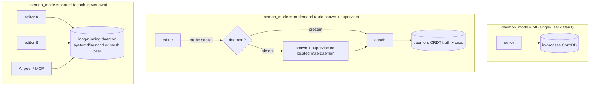

# ADR-035: Editor↔daemon boundary + the `daemon_mode` behavior-set

**Status:** Accepted (design).
**Extends:** ADR-014 (editor + daemon workspaces), ADR-029 (CRDT-truth / cozo-projection),
principle #12 (local-first; "the daemon is an optimization, not a requirement").
**Feeds:** the `daemon_mode` lifecycle, the daemon-feature UX surface, the Phase D thin-client (#107),
and the feasibility-sequenced daemon roadmap (ADR-028/031/033/034 + the embedding-provider prerequisite).

## Context

The Phase D "editor as thin client" work (ADR-029) made the editor read+edit a daemon-hosted KB and
skip its own preload. A read audit then showed a thin mirror breaks features that read the in-memory
`KnowledgeBase` directly with no query-layer path — chiefly **agenda** and **ranked search**. Realizing
those over the daemon would, taken to its end, make the daemon **required** for core KB power. That
collides with a stated design constraint:

> **Principle #12 (local-first):** "The daemon is an optimization for persistence and discovery, **not a
> requirement** for collaboration."

So before building further we must decide, on evidence rather than taste: **should mae require a daemon
for its KB/AI features?** And if a daemon is valuable, **how does a user get one** — auto-spawned on
demand, or a long-running shared service? The decision must weigh prior art, maintainability,
performance, inherent fragility, the **feasibility of the daemon's planned (unbuilt) value**, and the
fact that the boundary is a **first-class user-interaction surface** (the editor must adapt gracefully as
the daemon comes and goes, signal which features need it, and expose all of it to human/AI/Scheme per
principles #7 + #3).

## Decision

**Do NOT require a daemon. The embedded in-process CozoDB KB is the floor; the daemon is a configurable,
auto-spawnable, OS-supervised optimization + multi-client/coordination tier.** Principle #12 **holds**,
refined: the daemon is an *optimization with a first-class long-running mode*, never a hard dependency
for single-user KB/AI/IDE features.

Concretely:
1. A `daemon_mode` option with three values — **`off`** (in-process default), **`on-demand`** (editor
   auto-spawns + supervises a co-located daemon), **`shared`** (attach to an OS-supervised or remote
   daemon, never auto-owned).
2. A capability boundary defined by **objective value categories** (below), not preference.
3. A first-class **daemon-feature surface** (graceful adaptation + gating UX + full config parity).
4. **Fragility guardrails** lifted from prior art (version-pin, supervision, path parity, single trait).

### Why — the decisive evidence

A separate server is forced **only** by *multiple independent writers across machines* plus
durability-outliving-clients (the SQLite-vs-Postgres lesson; SQLite won the single-user case precisely
by being in-process). The single-user KB is the textbook in-process case (one client, one machine,
read-dominant). Therefore the daemon is the **multi-client / durability / coordination tier, never the
baseline**.

Reinforcing this: the daemon's *strongest future justification* — AI-enrichment "compute-once, share"
(ADR-031/034) — is currently **blocked** (see Feasibility). A "daemon-required" posture would rest
largely on capabilities that don't exist yet. Requiring the daemon now would trade away local-first for
a promise.

## The boundary, stated objectively (the four value categories)

A capability belongs in the daemon **iff** it earns at least one of these; otherwise it stays
in-process:

| Value | Earns daemon placement when… | Daemon-only capabilities today (file) |
|---|---|---|
| **SHARED** | one backend serves N frontends (RAM/compute multiplier) | TCP collab server + event broadcast over one `doc_store` (`collab_handler.rs`); federation query layer (`handler.rs`); editor LRU fills from one cozo. ~3–10× RAM vs N full mirrors. |
| **OUTLIVES** | useful work runs when no editor is open | WAL persistence + compaction + idle eviction (`doc_store.rs`, `storage.rs`); the maintenance scheduler — hygiene/health ticks (`scheduler.rs`, `hygiene.rs`); P2P dialer reconnect/backoff (`dialer.rs`). |
| **COORDINATES** | cross-peer trust + convergence | membership signing + trust anchors + `kb_access` gating (`doc_store.rs`, `collab_handler.rs`); mesh dial+pull (`dialer.rs`); live auth-key reload (`main.rs`). |
| **DURABILITY** | source-of-truth + self-heal | durable `kb:`/`kbc:` docs never deleted (`doc_store.rs`); content-hashed atomic checkpoint + import/export (`checkpoint.rs`); deterministic projector rebuild (`projector.rs`). |

**Editor owns** (low-latency interaction; must work daemon-less): buffers/modes/rendering/undo, LSP/DAP
clients, AI conversation, keybindings, **the in-process embedded KB (the floor)**, a bounded read cache.
**Shared via RPC:** KB queries (daemon cozo via JSON-RPC behind the `KbQueryLayer` trait + the editor
LRU). The split yields: *editor crash ≠ data loss; daemon crash ≠ editor crash* — and because the
daemon's state is WAL + CRDT, **daemon death is recoverable**, mae's deliberate divergence from Emacs's
lose-unsaved-state daemon.

## `daemon_mode` behavior-set

One `:set-save`-persistable option `daemon_mode` (config_key `daemon.mode`); supersedes the
ad-hoc `daemon_enabled`/`daemon_default` pair as the single posture knob:

1. **`off` (default)** — pure in-process embedded CozoDB. Zero daemon, IPC, or setup. The local-first
   floor (the SQLite/Obsidian/Logseq model).
2. **`on-demand`** — the `emacsclient -a ''` model: the editor probes `daemon_socket`; if absent it
   **auto-spawns + supervises a co-located `mae-daemon`**, awaits readiness, attaches. The daemon
   persists across editor restarts (startup amortization) but is owned + lifecycle-managed by the
   editor. The recommended "persistence/collab without thinking about it" mode.
3. **`shared`** — attach to an existing daemon (OS-supervised systemd/launchd, or a remote mesh peer);
   never auto-spawn or own it. The multi-session / multi-machine / P2P-mesh tier (ADR-025/026/027).
   **Self-hostable by design** (explicitly avoiding the Zed "open-source-but-not-self-hostable" trap).

`daemon_default`/`host_primary` (Phase D thin-client hosting) is **orthogonal** to `daemon_mode` and
stays experimental until its routing gap (below) closes.

## The daemon-feature surface (first-class)

The boundary is *where users feel the daemon*; it must be robust, honest, proactive, and fully
configurable.

**1. A capability model (replaces ad-hoc guards).** Today, daemon-dependent features fail with bespoke
strings (e.g. P2P share: *"not connected to a daemon — start one with…"`). Centralize into one
`DaemonRequirement { None | Recommends | Requires }` per feature + the mode/state it needs — the single
source of truth for gating, UX, and introspection:
- **None** (the in-process floor; always works): local KB read/edit, agenda, search, LSP/DAP, AI
  conversation, editing/rendering.
- **Recommends** (works degraded, better with the daemon): KB hosting / thin-client; persistence across
  many editor lifecycles; multi-frontend resource sharing.
- **Requires** (cannot work without it): **P2P KB sharing**; **continuous shared-KB sync that prevents
  content divergence from peers' offline edits**; mesh membership.

`feature_availability(feature) → Available | Degraded(why) | Unavailable(why, how-to-fix)` is answered
*before* an action, so surfaces show an actionable reason — never a silent failure.

**2. Graceful runtime adaptation.** Daemon state = `(mode, read-layer-up?, collab-connected?, hosting?)`.
On every transition, recompute feature availability and adapt **without crash or data loss**. The
mechanics are already graceful (on disconnect the editor snapshots the mirror, releases in-flight
updates, marks buffers offline, accumulates a durable pending queue, and re-drains on reconnect). The
gap is **proactive surfacing**: daemon state is shown only on-demand today (`*Collab Status*` buffer);
the ADR-024 NotificationCenter is never raised for daemon connect/loss. Add severity-routed
notifications: connected → status; **lost-while-hosting/sharing → badge**; read-layer vs collab-TCP
surfaced distinctly.

**3. The divergence-risk surface.** A continuously-synced *shared* KB edited offline while the daemon is
down can **diverge** until resync. Surface it honestly: a per-shared-KB indicator —
`syncing | offline (N pending) | reconnecting` — on the mode-line + the `*KB Sharing*`/`*Collab Status*`
buffers, plus a **badge when offline edits accumulate on a shared KB with no daemon**. Pending edits are
durable (survive offline + restart, ADR-020), so the message is *"deferred, not lost"* — and the UX must
say exactly that. (The robustness guarantee — WAL + CRDT + durable queue ⇒ convergence on reconnect — is
the content of this surface.)

**4. Config parity (principles #7 + #3).** `daemon_mode` + the gating config must be drivable by human
(`:set`/`:set-save`), Scheme (`set-option!` + new `(daemon-available?)`/`(daemon-status)`/`(feature-available? …)`
queries), and the AI peer (the existing `collab_*`/`kb_*` tools + a new `save_option_to_init` tool + a
capability/availability query tool), all through the existing `DaemonControl` single backend that
already gives P2P parity. Plus: add the `daemon_mode`/P2P step to `setup-collab`.

## Feasibility of the daemon's planned value (grounds the decision)

The unbuilt ADRs define the daemon's intended near-term value. Graded so the decision rests on what's
achievable:

| ADR | Daemon value | Grade | Basis |
|---|---|---|---|
| **033** coordination (lease + epoch fence) | dedup peer compute | **GREEN** | all primitives exist (ADR-023 fence, ADR-024 bus, ADR-026 tiebreak); textbook Kleppmann fencing. The realizable near-term value-add. |
| **020 D1** hosted live-edit | edit a daemon-hosted KB | **YELLOW** | reads route; needs a write-path choice (client-owns-yrs+push vs daemon-owns). |
| **028** data lifecycle | durability + recovery | **YELLOW** | checkpoint/WAL proven; unknown = convergence-frontier tracking ("every member acked?") in a leaderless mesh. |
| **025/026/027** P2P mesh | leaderless sync + trust | **GREEN→YELLOW** | transport + signed single-owner membership shipped; quorum + observability follow-on; leaderless content-op signing is **RED/research**. |
| **031** derived intelligence | RAG + compute-once | **RED** | blocked — see crux. |
| **034** cross-peer artifact sharing | share vectors, not recompute | **RED** | depends entirely on 031. |

**The crux — mae has no embedding-generation infrastructure today.** The cozo HNSW schema +
`store_embedding` + `vector_search` exist, but **nothing produces vectors**: the `kb_vector_search` tool
explicitly stubs *"no embedding provider is configured"*, and there is no ONNX/candle/fastembed dep nor
any embeddings-API call. So the daemon's marquee justification (031/034) is gated on an **operational
choice not yet made** (provider: hosted API vs local model) — low *design* risk once chosen, but absent
today. This is decisive: **it reinforces "don't require the daemon"** (its biggest payoff is future +
blocked), and it names the prerequisite that unlocks that payoff.

## Inherent-fragility guardrails (from prior art)

- **Version skew** (the #1 long-daemon failure — Emacs runs stale byte-code after upgrade): version-pin
  the daemon to the editor by build-id/commit hash; on mismatch refuse-and-offer-restart (VS Code
  Remote's discipline). Skew becomes structurally impossible.
- **Single KB trait, two backends:** in-process vs daemon-routed behind one `KbQueryLayer`; **close the
  thin-client routing gap (agenda + ranked search + ~3 more) BEFORE any thin mode defaults on** — that
  gap *is* the dual-mode tax surfacing.
- **Supervision:** `shared` → OS units (`assets/mae-daemon.service` + a launchd plist). `on-demand` →
  readiness handshake + **bounded restart with a circuit breaker** (Jupyter `restart_limit=5`; VS Code
  "crashed 5×, won't restart") — never an infinite respawn loop.
- **XDG path parity** at spawn AND connect, identical macOS+Linux (principle #13; Emacs's classic
  stale-socket bug). `daemon_socket="auto"` must resolve the same on both sides.
- **Env staleness:** a daemon owning AI/shell/KB needs an env-refresh story (Emacs snapshots env once →
  SSH_AUTH_SOCK/PATH/DISPLAY drift).
- **stderr-only daemon logging** (stdout corrupts JSON-RPC framing) + one diagnostic surface
  (`collab-doctor`/`pkg-doctor`). **Durable-so-death-is-recoverable** (WAL + CRDT) — already true.

## Consequences

**Positive.** Local-first holds (#12). Single users pay zero daemon cost; the in-process KB is the
floor. The daemon's real, near-term value (coordination, durable sync, multi-frontend sharing, mesh
trust) is delivered where it objectively earns its place. `on-demand` makes "persistence/collab without
thinking" near-invisible (the emacsclient precedent). `shared` is self-hostable + OS-supervised. The
capability model + proactive surface make the boundary honest and robust.

**Costs.** Two run modes to maintain — bounded by the single-trait discipline + version-pinning. The
thin-client routing gap must be closed before any thin mode defaults on. The daemon's marquee value is
gated on the embedding-provider prerequisite. A small amount of new surface code (capability model,
proactive notifications, the divergence indicator, the config-parity tools).

## Alternatives rejected

- **Daemon-required (revise principle #12).** Rejected: forces a server where the evidence says
  in-process wins for single users; would be justified largely by *future + blocked* capabilities
  (031/034); a hard setup cliff. Anti-precedent: Zed's de-facto-non-self-hostable collab.
- **Daemon-optional but no first-class long-running mode** (today's `daemon_enabled` only). Rejected:
  no auto-spawn (the emacsclient win) and no supervised shared mode for the multi-machine/P2P tier —
  leaves the daemon as a manual chore (the Docker-`dockerd` annoyance).
- **In-process only (drop the daemon).** Rejected: forfeits the genuine SHARED/OUTLIVES/COORDINATES/
  DURABILITY wins (multi-frontend, P2P, background maintenance, source-of-truth) that the daemon
  already delivers.

## Precedents

- **Emacs `emacsclient -a ''`** — auto-spawn-on-demand UX (`on-demand` mode).
- **SQLite serverless / `whentouse`** — why in-process is the correct single-user default.
- **Anytype `anytype-heart`** — editor + co-located daemon + optional self-hostable sync (our exact
  shape, proven end-to-end).
- **VS Code Remote** — version-pin the editor-provisioned server to eliminate skew.
- **LSP / Jupyter** — editor owns child lifecycle + bounded-restart supervision.
- **Tailscale / Syncthing vs Docker / Podman** — what makes a long-running daemon invisible (auto-start,
  OS-supervised, low idle, no manual lifecycle) vs a cliff.

## Verification

ADR is peer-reviewable from the topology diagram + the four-value table. For the implementation:
`off` → full standalone (KB/agenda/search in-process, no daemon); `on-demand` → first launch
auto-spawns + supervises, survives editor restart, circuit-breaks after repeated crashes; `shared` →
attaches, never owns; version-skew → editor refuses a mismatched daemon. **Surface:** drive daemon
up→down→up + mode transitions and assert graceful adaptation (no crash, no data loss, pending edits
converge), correct gating (a `Requires` feature shows an actionable reason), proactive notifications fire
(badge on loss-while-sharing), the per-shared-KB divergence indicator is honest ("N deferred, not
lost"), and the same `daemon_mode`/capability config + queries behave identically from `:set` / Scheme /
AI (#7/#3 parity). `make ci-all` + cross-OS (#13).
