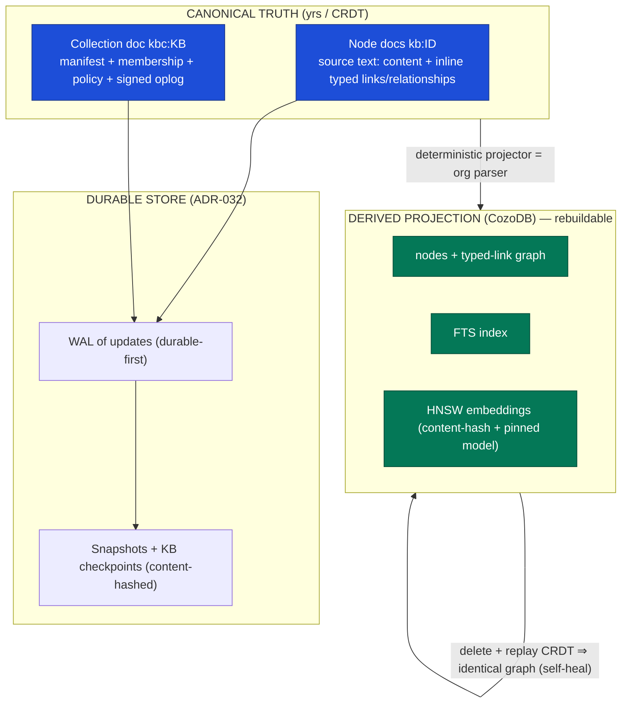
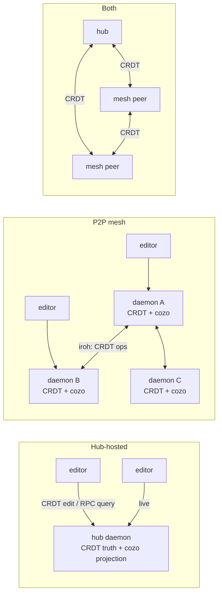
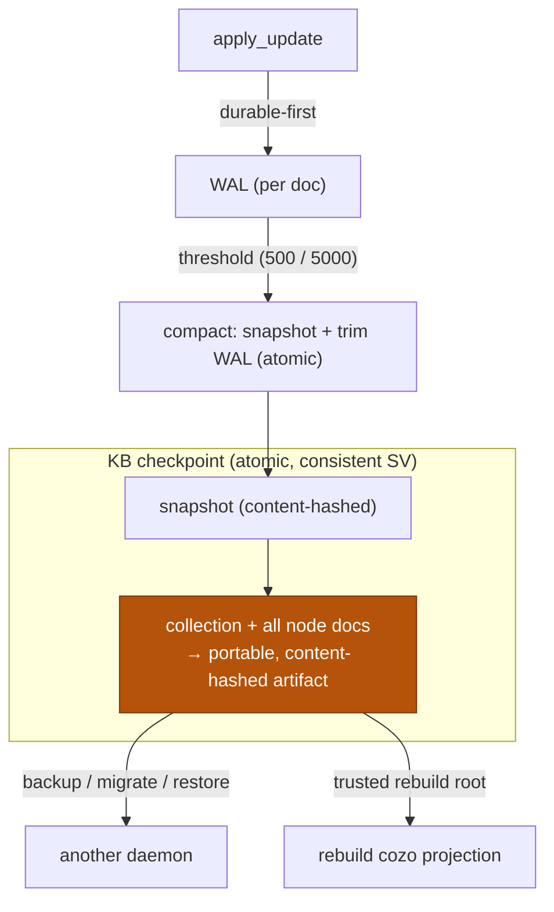
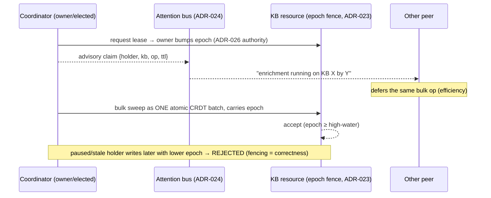

# MAE KB — multi-peer architecture (CRDT truth, cozo projection)

> Peer-review document for the KB data-architecture redesign.
> Decisions: **ADR-029** (source of truth), **ADR-030** (in-text relationships / parser-as-projector),
> **ADR-031** (derived intelligence), **ADR-032** (durable CRDT store), **ADR-033** (operation
> coordination), **ADR-034** (cross-peer derived-artifact sharing). Builds on the P2P-mesh trio
> (ADR-025/026/027), the epoch fence (ADR-023), and the attention bus (ADR-024).

## 1. The one-paragraph model

The **yrs/CRDT layer is the canonical source of truth**: each KB node is a yrs document whose body
is org/markup-flavored **source text** (content + typed links + relationship metadata inline,
org-roam style), and the collection doc holds the node manifest + membership + policy + signed
oplog. **CozoDB is a deterministic, durable, rebuildable PROJECTION** of that truth — the graph +
FTS + vector index and the home of derived intelligence — maintained **locally by every daemon that
holds a CRDT replica**. The editor is a **thin client** of its local daemon. This is the only model
that is correct across all sync configurations (hub, P2P mesh, both), because the CRDT decouples
*replication transport* from *source of truth* from *projection*.

## 2. Layers & source of truth



| Data | Source of truth | Lives / queried in | Synced? |
|---|---|---|---|
| Node content + **typed links/relationships** + org metadata | **CRDT source text** | cozo projection | yes (CRDT) |
| Manifest / membership / policy / oplog | **CRDT** (collection doc) | cozo + access gate | yes (CRDT) |
| Typed-link graph (rel_type/weight/confidence) | derived from text | **cozo** (durable, incremental) | converges via projector |
| FTS | derived | cozo | local rebuildable |
| Vector embeddings | derived, **local** | cozo | not truth; optional cache-warm (ADR-034) |
| Hygiene / AI suggestions | derived OR authored-into-text | cozo / text | coordinator runs; may be CRDT edits |

## 3. Data lifecycle (edit → truth → projection → query/RAG)

```mermaid
sequenceDiagram
    participant U as Editor (thin client)
    participant D as Local daemon
    participant DS as doc_store (CRDT truth + WAL)
    participant PJ as Projector (org parser)
    participant CZ as CozoDB projection
    participant P as Peers (hub / mesh)

    U->>D: edit node text (CRDT op)
    D->>DS: apply_update (WAL-first, durable)
    DS-->>P: replicate CRDT op (transport-agnostic)
    DS->>PJ: change feed (changed node)
    PJ->>PJ: parse text → nodes + typed links (deterministic)
    PJ->>CZ: upsert nodes/links/FTS; schedule embed (content-hash cache)
    U->>D: query (search / graph / vector / RAG)
    D->>CZ: read (fast, local)
    CZ-->>U: results
    Note over DS,CZ: delete CZ → replay CRDT ⇒ identical projection (self-heal)
```

The **universal seam**: every update — hub and p2p — lands at `doc_store.apply_update`. The
projector subscribes to that one change feed, so projection logic is identical regardless of
transport.

## 4. Replication across configurations



- **Hub:** one authoritative CRDT replica + one cozo projection on the hub; thin clients query via
  RPC (the `LruQueryLayer` cache hides latency).
- **P2P:** each daemon has a CRDT replica + a local cozo projection; editors query their *local*
  daemon (lowest latency). Projections converge because the CRDT converges and the projector is
  deterministic.
- **Both:** CRDT flows over hub *and* mesh; idempotent `apply_update` makes double-delivery safe.

**Determinism contract (ADR-029):** same converged CRDT ⇒ byte-identical cozo *structural* graph on
every peer. Embeddings converge given a **pinned per-KB model**; they are local, not synced truth.

## 5. Durable storage & checkpoints (ADR-032)



Hardening (vs the ephemeral-session origin): **pin durable/owned KB docs** (idle-evict from memory
only, never delete from disk); **LRU memory over an unbounded durable set**; **atomic KB
checkpoint**; **backup/restore**; **snapshot integrity** (content-hash + verify, self-heal).

## 6. Coordinating bulk operations (ADR-033)



Strict mutual exclusion is impossible (and unnecessary) in the leaderless config. The **advisory
lease** is for efficiency (peers defer); the **epoch fence** at the resource is for correctness (a
stale writer's bulk op is rejected). Hub may additionally arbitrate the lease; the fence stays
mandatory.

## 7. Cross-peer derived-intelligence sharing (ADR-034)

```mermaid
flowchart LR
    SRC["same source CRDT + pinned model"] --> COORD["coordinator computes once"]
    COORD -->|"relationships → CRDT text (ADR-030)"| FREE["syncs free — no peer re-runs AI"]
    COORD -->|"embeddings → content-addressed cache<br/>key (content_hash, model, chunk)"| CACHE["members FETCH, not recompute"]
    LOCAL["structural graph + FTS"] -->|cheap, deterministic| PERPEER["each peer rebuilds locally"]
    CACHE -.->|membership-gated trust (ADR-026)| MEMBER["member only; non-member ignored"]
```

Three-way split: reproducible-as-content → **into the CRDT** (free sync); expensive non-textual
(embeddings) → **content-addressed cache**, membership-gated, compute-once; cheap deterministic
(graph/FTS) → **local**. Per-KB collection settings pin the model + toggle `share_derived_artifacts`
+ name the coordinator.

## 8. Phasing (epics)

`Phase 0` docs/ADRs/RoamNotes (this) · `A` durable store hardening · `B` projector backbone ·
`C` in-text relationship grammar · `D` editor as thin client · `E` derived intelligence ·
`F` operation coordination · `G` cross-peer derived sharing · `H` org ingestion + headless host ·
`I` cross-config validation + RoamNotes dogfood.

## 9. Open questions for review

1. Final **link-grammar** form for weight/confidence (ADR-030) — attribute group vs org-link
   parameters; the versioning/upcast story.
2. **Atomic KB checkpoint** mechanism — brief write-gate vs SQLite snapshot isolation across many
   per-node docs (ADR-032).
3. **Coordinator election** when the owner is offline — owner-default vs ADR-026-quorum-elected
   (ADR-033).
4. **Derived-artifact transport** — reuse the collab stream vs a side channel; advertise/request
   protocol shape (ADR-034).
5. Editor **daemon-less embedded** mode — how much of the daemon's projector/store to embed for the
   standalone fallback (Phase D).
